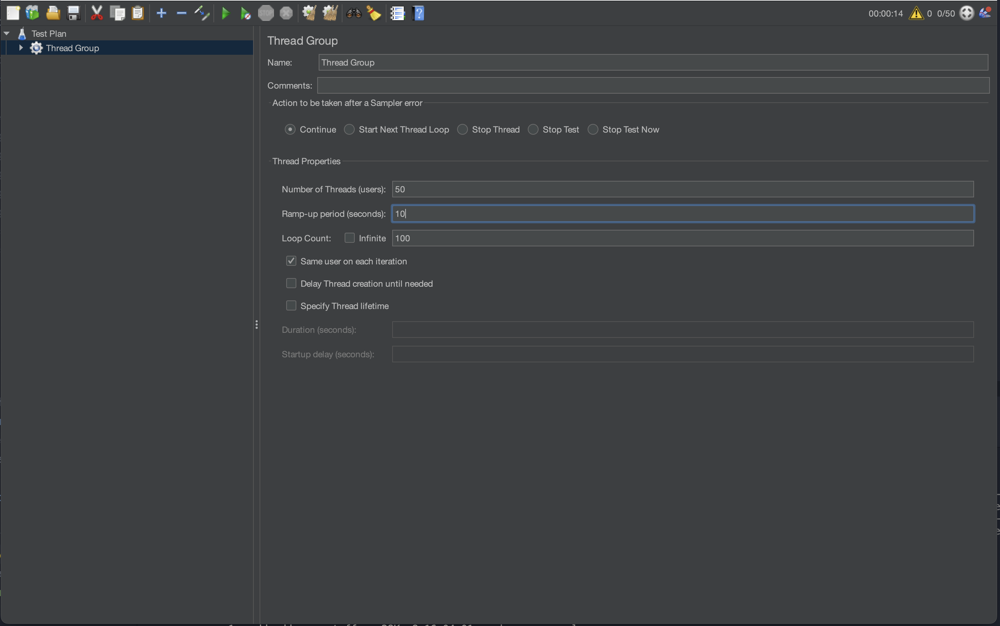

[toc]

# Gunicorn and FastAPI with Multi-Process Logger

작성중...

## Tested Environment

- Python 3.8.19 (Anaconda)

```bash
                    'c.          MacBookPro.local
                 ,xNMM.          --------------------------------------------
               .OMMMMo           OS: macOS 14.5 23F79 arm64
               OMMM0,            Host: MacBookPro18,1
     .;loddo:' loolloddol;.      Kernel: 23.5.0
   cKMMMMMMMMMMNWMMMMMMMMMM0:    Uptime: 2 days, 12 hours, 49 mins
 .KMMMMMMMMMMMMMMMMMMMMMMMWd.    Packages: 123 (brew)
 XMMMMMMMMMMMMMMMMMMMMMMMX.      Shell: zsh 5.9
;MMMMMMMMMMMMMMMMMMMMMMMM:       Resolution: 1728x1117
:MMMMMMMMMMMMMMMMMMMMMMMM:       DE: Aqua
.MMMMMMMMMMMMMMMMMMMMMMMMX.      WM: Quartz Compositor
 kMMMMMMMMMMMMMMMMMMMMMMMMWd.    WM Theme: Blue (Dark)
 .XMMMMMMMMMMMMMMMMMMMMMMMMMMk   Terminal: iTerm2
  .XMMMMMMMMMMMMMMMMMMMMMMMMK.   Terminal Font: Monaco 12
    kMMMMMMMMMMMMMMMMMMMMMMd     CPU: Apple M1 Pro
     ;KMMMMMMMWXXWMMMMMMMk.      GPU: Apple M1 Pro
       .cooc,.    .,coo:.        Memory: 4085MiB / 32768MiB

```

## Install Libraries

### Python Libraries(required)

```bash
pip install -r requirements.txt
```

### JMeter(optional)

```bash
brew install jmeter
```

## Run Project

### Run Server

```bash
chmod +x run_gunicorn.sh
./run_gunicorn.sh
```

### Test the APIs

```bash
sh test/get.sh
sh test/post.sh
```

#### With JMeter

```bash
jmeter
```


